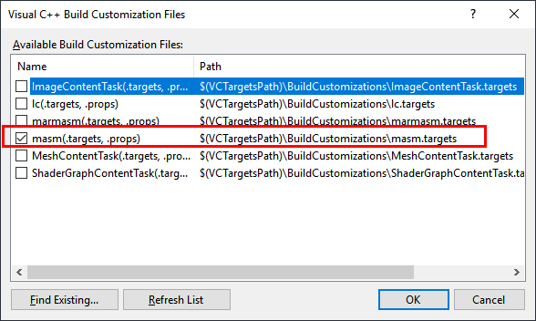

# 04. Низкоуровневые операции в Visual C/C++

Под низкоуровненвыми операцияими (в данной работе) мы будем понимать операции, которые невозможно выполнить стандартными средствами C/С++ и которые требуют обращения к уровню языка ассемблера и/или машинным инструкциям.

В Visual C/C++ есть 3 основных механизма реализации низкоуровневых операций для процессоров x86/x64:
- встроенные в компилятор функции ([intrinsics](https://en.wikipedia.org/wiki/Intrinsic_function))
- встроенный ассемблер для архитектуры x86 (inline assembler)
- Microsoft Macro assembler (MASM)

Все эти способы описаны в статье [Compiler Intrinsics and Assembly Language](https://docs.microsoft.com/en-us/cpp/intrinsics/compiler-intrinsics-and-assembly-language)

Для знакомства со всеми тремя вариантами мы будем использовать инструкцию процессорв [CPUID](https://en.wikipedia.org/wiki/CPUID)


## Встроенный ассемблер

1. Создайте пустой проект C++ в Visual Studio (например с именем **CPUID**).
2. Добавьте в него файл **main.c** содержанием:
```C
#include <stdio.h>

int inlineasm(char *manufactor_id);

int main()
{
	char name[20];
	int func_count = inlineasm(name);
	printf("Inline: %d  %s\n", func_count, name);

	return 0;
}
```

3. Добавьте к проекту файл **inlineasm.c** содержащий функцию:
```C
int inlineasm(char *manufactor_id)
{
	int function_count;

	__asm {

		mov eax, 0
		cpuid

		mov function_count, eax

		mov eax, manufactor_id

		mov [eax], ebx
		mov [eax+4], edx
		mov [eax+8], ecx
		mov [eax+12], 0
	}

	return function_count;
}
```

4. Настройте проект на использование статических библиотек [как это сделано в тестовом приложении в лабораторной №1](../lab/01_New_system_call.md)

5. Скомпилируйте и запустите проект. В большинстве случаев, выведется результат похожи на следующий

```
Inline: 22  GenuineIntel
```

### Тестирование на виртуальной машине

1. Для дестирования работоспособности проведите тест на базе VirtualBox. Для этого:
- перейдите в каталог с VirtualBox (**C:\\Program Files\\Oracle\\VirtualBox\\**) и выполните команду

```
VBoxManage.exe modifyvm <имя_вашей_VM> --cpuid-set 0 22 0x6168694d 0x6f6e616d 0x6f526c69
```

- запустите вашу виртуальную машину
- перенесите на неё утилиту
- запустите и сравните результат с тем, что показывает программа **msinfo32** 


## Microsoft Macro assembler

1. Вернитесь к исходному проекту
2. Откройте пункт основного меню **Project\\Build Customizations...**
3. Установите галочку напротив пункта **masm**:



4. Добавьте в проект пустой файл **pureasm.asm** со следующим содержанием:

```Asm
.model flat
.code

pureasm PROC C

	push ebp
	mov ebp, esp

	mov eax, 0
	cpuid

	push eax

	mov eax, [ebp+8]

	mov [eax], ebx
	mov [eax+4], edx
	mov [eax+8], ecx
	mov dword ptr [eax+12], 0

	pop eax

	mov esp, ebp
	pop ebp

	ret 

pureasm ENDP

END
```

5. Перейдите к файлу **main.c** и добавьте в него прототип и вызов только что созданной функции. Например, так:

```C
#include <stdio.h>

int inlineasm(char *manufactor_id);
int pureasm(char *manufactor_id);

int main()
{
	char name[20];
	int func_count = inlineasm(name);
	printf("Inline: %d  %s\n", func_count, name);

	char name2[20];
	int func_count2 = pureasm(name2);

	printf("Pureasm: %d  %s\n", func_count2, name2);

	return 0;
}
```

6. Запустите программу и проверьте полученный результат

## Использование intrinsics

1. Добавьте в проект файл **intrinsic.c**
2. Заполните его содержимое:

```C
int intrinsic(char *manufactor_id)
{
	int cpuInfo[4];
	__cpuid(cpuInfo, 0);

	int *m = manufactor_id;

	m[0] = cpuInfo[1];
	m[1] = cpuInfo[3];
	m[2] = cpuInfo[2];
	m[3] = 0;

	return cpuInfo[0];
}
```

3. Доработайте файл **main.c**

```C
#include <stdio.h>

int inlineasm(char *manufactor_id);
int pureasm(char *manufactor_id);
int intrinsic(char *manufactor_id);

int main()
{
	char name[20];
	int func_count = inlineasm(name);
	printf("Inline: %d  %s\n", func_count, name);

	char name2[20];
	int func_count2 = pureasm(name2);

	printf("Pureasm: %d  %s\n", func_count2, name2);

	char name3[20];
	int func_count3 = intrinsic(name3);

	printf("Intrinsic: %d  %s\n", func_count3, name3);

	return 0;
}
```

4. Проверьте полученный результат
